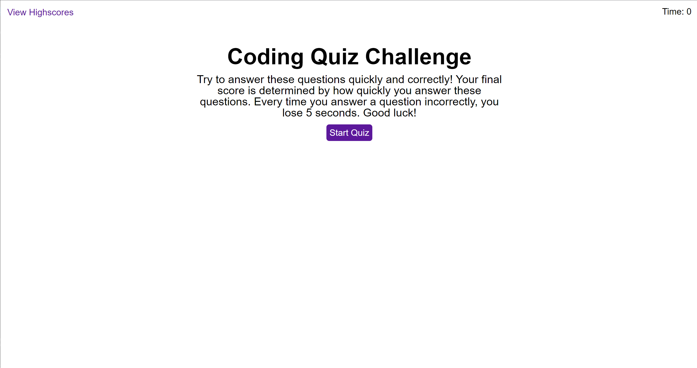

# code-quiz

## Description

**Goal:** To develop an interactve quiz from scratch with capabilites including dynamically updates HTML and CSS, a countdown timer, time penalties on incorrect answers, and a way to save scores.

Web development is one of the fastest moving industries, and it can be difficult to keep up with all the new terms and concepts being invented. It is important as web developers to stay up to date with web development concepts and ideas. One helpful way to learn is by quizzing yourself. This application is meant to quiz users on coding-related topics.

## Development

1. Wireframed the different pages including: a start page with a short description, a quiz page, an end page, and a highscore page. Mapped out which parts would be moving or have events attached to them (buttons, input bars, etc.).
2. Added basic HTML structure including a nav bar, and four different main sections to emulate mulitple webpages. Created placeholders for moving parts like the answers and highscore boards.
3. Added basic CSS to create consistent feeling across "windows". Includes responsive CSS for buttons.
4. Wrote basic JavaScript functions for "window" navigation between sections. Implemented event listener functions onto answer buttons.
5. Implemented timer to stop when time runs out or when all the questions are answered.
6. Implemented a way to check the answers and deduct time if answers were incorrect.
7. Implemented highscore storage that accesses local storage and stays consistent over page reloads.

## Deployment

[Deployed Webpage](https://supsha878.github.io/code-quiz/)